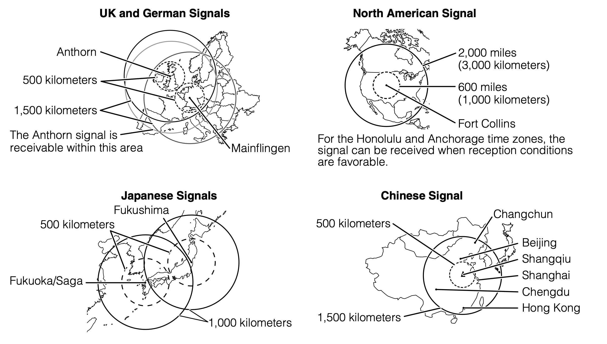

# Web Multiband Simulator

A browser-based tool to synchronize radio-controlled watches (such as Casio Multiband watches and Citizen Atomic Timekeeping watches) by simulating longwave atomic clock radio signals directly through your computer or smartphone speakers.

## Supported Protocols

This simulator supports the major global time signal stations:

* **BPC (China):** 68.5 kHz (17.125 kHz sawtooth, 4th harmonic)
* **WWVB (USA):** 60 kHz (20 kHz square wave, 3rd harmonic)
* **DCF77 (Germany/Europe):** 77.5 kHz
* **MSF (UK):** 60 kHz (20 kHz sawtooth wave, 3rd harmonic)
* **JJY (Japan):** 40 kHz (13.333 kHz square wave, 3rd harmonic)

## How It Works

Atomic clocks require high-frequency radio waves (e.g., 60 kHz to 77.5 kHz) to synchronize. However, standard computer sound cards cannot output audio above ~22 kHz due to the Nyquist limit.

To bypass this hardware limitation, this simulator relies on **audio clipping and harmonics**:
1. The Web Audio API generates a specific lower-frequency base tone (e.g., a 20 kHz square wave or 15.5 kHz sawtooth).
2. By maximizing your device's volume, the physical audio amplifier is intentionally overdriven.
3. This overdriving "clips" the waveform, turning it into a square-like wave that physically emits high-energy electromagnetic **harmonics** (3rd, 4th, or 5th order).
4. These electromagnetic harmonics hit the exact target frequencies (e.g., $15.5 \text{ kHz} \times 5 = 77.5 \text{ kHz}$) required by your watch's internal antenna.

## How to Use

1. **Verify Time Accuracy:** Ensure your computer's clock is perfectly synced. You can ping a public NTP server or use an online time service.
2. **Select Protocol:** Choose the time signal your specific watch expects to receive.
3. **Maximize Volume:** Turn your computer or smartphone volume up to **100%**. This is strictly required to induce the clipping distortion that generates the necessary radio harmonics.
4. **Position the Watch:** Place your radio-controlled watch as close to the speaker or headphones as possible.
5. **Transmit:** Press **Start Transmitting** and put your watch into its manual receive mode. Wait several minutes, as these protocols transmit only one data frame per minute.

## Testing and Results

This project is tested limitedly on a MacBook Pro (2021) with a Casio G-Shock GWM5610 and a Casio Pro Trek PRW-61FC. Results may vary based on your device's hardware and environmental conditions.

| Signal | GWM5610 | PRW-61FC |
| ------ | ------- | -------- |
| WWVB | N/A | N/A |
| BPC | N/A | N/A |
| DCF77 | N/A | N/A |
| MSF | N/A | N/A |
| JJY | N/A | N/A |

In addition, since the author only relies on WWVB, the other protocols may not be fully tested. Feedback and contributions are very welcome to improve the simulator's accuracy and usability!

## Notes

* This simulator is designed for educational and experimental purposes. Results may vary based on your device's hardware and environmental conditions.
* This tool is heavily inspired on the open-source project [`web-jjy`](https://github.com/shogo82148/web-jjy).